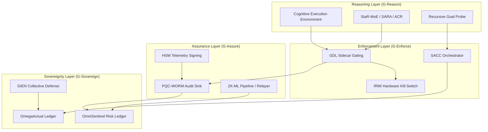

# G-Stack: Vertical Governance Architecture (Visual)

```mermaid
graph TD
    subgraph "Reasoning Layer (G-Reason)"
        CEE[Cognitive Execution Environment]
        MoE[StaR-MoE / SARA / ACR]
        RGPP[Recursive Goal Probe]
    end

    subgraph "Enforcement Layer (G-Enforce)"
        GDL[GDL Sidecar Gating]
        IRMI[IRMI Hardware Kill-Switch]
        SACC[SACC Orchestrator]
    end

    subgraph "Assurance Layer (G-Assure)"
        WORM[PQC-WORM Audit Sink]
        ZK[ZK-ML Pipeline / Relayer]
        HSM[HSM Telemetry Signing]
    end

    subgraph "Sovereignty Layer (G-Sovereign)"
        OA[OmegaActual Ledger]
        OS[OmniSentinel Risk Ledger]
        GIEN[GIEN Collective Defense]
    end

    CEE --> GDL
    GDL --> WORM
    RGPP --> SACC
    MoE --> GDL
    GDL --> IRMI
    WORM --> OS
    SACC --> OA
    ZK --> OS
    HSM --> WORM
    GIEN --> OA
```

---
*Note: This diagram represents the vertical integration of the G-Stack across G-SIFI infrastructures.*
